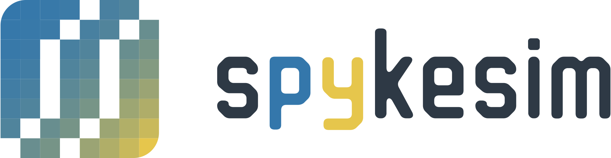

# 
[](https://pypi.org/project/spykesim/)
[](LICENSE)
[](https://travis-ci.org/KeitaW/spykesim)

spykesim is a Python module that offers functions for measuring the similarity between two segmented multi-neuronal spiking activities.

Extended edit similarity measurement is implemented. You can find details in the following paper.

https://www.frontiersin.org/articles/10.3389/fninf.2019.00039

This library is re-implementation of the algorithm. The original implementation can be found in [this repo](https://github.com/KeitaW/Chaldea).

# Supported Operating Systems
This library tested on Ubuntu and MacOS.

For Windows users: Please consider to use Ubuntu via [Windows Subsystem for Linux](https://docs.microsoft.com/en-us/windows/wsl/install-win10).

# Installation
If you do not have Python3.7 on your environment, you may use [Anaconda](https://www.anaconda.com/distribution/).

[Cython](https://github.com/cython/cython) and [Numpy](https://github.com/numpy/numpy) needs to be preinstalled as these will be used in the installation process.

If you have not installed these packages, run the following:
```bash
pip install numpy cython
```
You can install this library via pip as well:
```bash
pip install spykesim
```
or you may clone and build by yourself:
```bash
git clone https://github.com/KeitaW/spykesim.git
cd spykesim
python setup.py build_ext --inplace install
```

## Dependencies

- Python (>= 3.7)
- Numpy(Needs to be preinstalled)
- Cython(Needs to be preinstalled)
- scipy
- tqdm
- h5py

# Tutorial 
You can find a tutorial in [doc](https://github.com/KeitaW/spykesim/blob/master/docs/tutorial.ipynb).

# Citation
You can use the following bib entry to cite this work:
```
@article{Watanabe:2019eq,
author = {Watanabe, Keita and Haga, Tatsuya and Tatsuno, Masami and Euston, David R and Fukai, Tomoki},
title = {{Unsupervised Detection of Cell-Assembly Sequences by Similarity-Based Clustering}},
journal = {Frontiers in Neuroinformatics},
year = {2019},
volume = {13},
month = may
}
```
# 


This project uses the following repository as a template.

https://github.com/kennethreitz/samplemod 
The original LICENSE file can be found in [here](misc/original_license.md).
